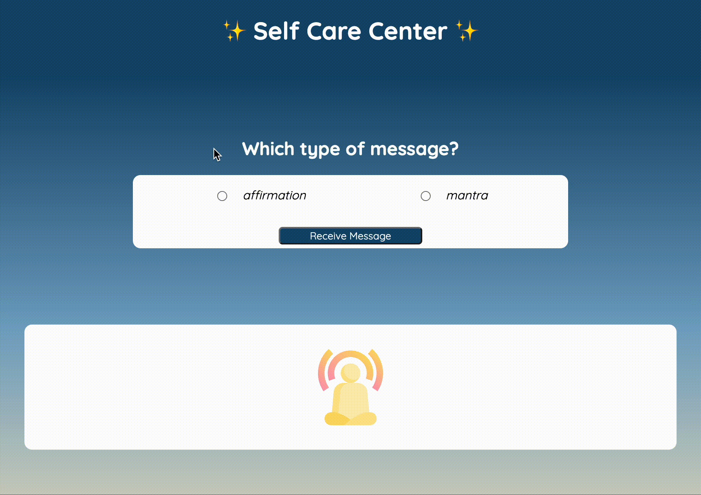

# Self-Care Center 
### Abstract:
[//]: <> (Briefly describe what you built and its features. What problem is the app solving? How does this application solve that problem?)
This self care app provides the user a randomly generated message based on the type of message requested - Affirmation or Mantra! It is the hope that the user will find a message that speaks to them or provides an instant insight or focus to bring in a more positive balance.

#### Features:
- Choose which type of message you wish to receive - Affirmation or Mantra
- Animations included:
    - radio buttons grow on hover
    - dynamic gradient backgrounds based on type of message requested
    - stylized loading spinner
    - fade-in on received message

### Installation Instructions:
[//]: <> (What steps does a person have to take to get your app cloned down and running?)
#### If interested in contributing to this project:
1. `git clone` the repo to your local machine
2. `cd self-care-center` into the newly cloned folder
3. type `open index.html` to run the webapp locally!

### Preview of App:
[//]: <> (Provide ONE gif or screenshot of your application - choose the "coolest" piece of functionality to show off.)

### Context:
[//]: <> (Give some context for the project here. How long did you have to work on it? How far into the Turing program are you?)
- I spent about 5 hours a day on this project Wed-Sun, for a total of ~25hrs
- This was our Turing Mod1, Week3 solo project.

### Contributors:
[//]: <> (Who worked on this application? Link to their GitHubs.)
- [mbenfowler](https://github.com/mbenfowler)

### Learning Goals:
[//]: <> (What were the learning goals of this project? What tech did you work with?)
- Gain experience building an application that utilizes HTML, CSS and JavaScript
- Write HTML and CSS to match a provided comp
- Understand how to listen to and respond to user events
- Individualize your programming skill set

### Wins + Challenges:
[//]: <> (What are 2-3 wins you have from this project? What were some challenges you faced - and how did you get over them?)

#### Wins:
- in-depth event listener work
- super clean HTML and CSS

#### Challenges:
- Proper parent sizing is difficult when toggling visibility between many different children
- I spent a lot of time troubleshooting the timing of the needed animations
    - The biggest challenge being not realizing I needed an execution "wait" on the message reveal as I waited for the previous animations to resolve.